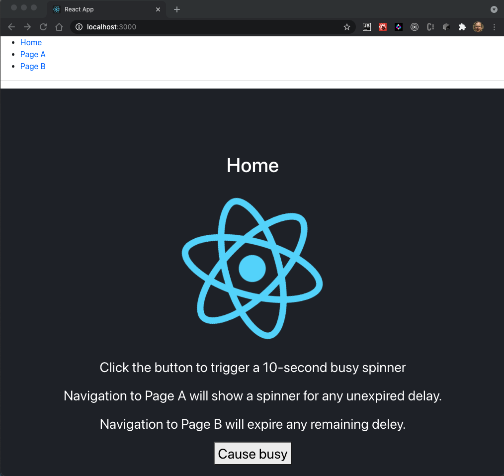
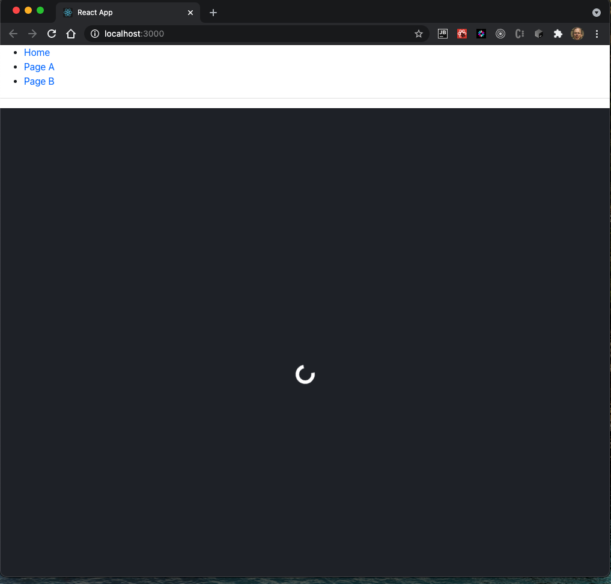

# Busy Spinner for React 16.x+

This project illustrates using hooks to propagate a busy state
to downstream components that display a busy spinner based on state.

A React context provider in the main component, `App.jsx`, exposes 
1. busy state
1. setter for busy state
1. loading spinner component.

Any component wishing to present a busy spinner durring a busy network
operation would consume the context:

```javascript
const {isBusy, setBusy, Spinner} = useContext(BusyContext);
```

+ The consumer would render the passed `<Spinner />` in lieu of its
content whenever `isBusy` is true 
+ Any comsumer of the context would clear the busy state via the `setBusy(false)` callback
+ Then a conditional render on a false `isBusy` would display normal 
content instead of the spnnner


## Installation

+ `git clone <ssh or http>`
+ `yarn install`  (from project root)

## Try

+ Issue `yarn start` from the project root.
+ The default browser opens the application UI on port 3000.

A crude navigation 
bar allows swtiching the current page between:

+ Home (click a button to set `isBusy`; renders spnnner if `isBusy`; normal content if not)
+ Page A (spnnner if `isBusy`; normal content if not)
+ Page B  (always resets `isBusy`)

A click of a button on the homem page sets `isBusy` to true and then
issues a `setTimeOut` of 10 seconds tied that sets `isBusy` to false.

Any pages that consume the `useContext` can display the spinner component sent in the context
whenever the `isBusy` is true. Any consuming page can call `setIsBusy(false)` to reset busy. the 
spnner will extinguish for any participating page no matter how the render flows to it.

## Screens

### Home



### Busy Spinner on Any Page



---------------------

## Available Scripts

In the project directory, you can run:

### `yarn start`

Runs the app in the development mode.\
Open [http://localhost:3000](http://localhost:3000) to view it in the browser.

The page will reload if you make edits.\
You will also see any lint errors in the console.

### `yarn test`

Launches the test runner in the interactive watch mode.\
See the section about [running tests](https://facebook.github.io/create-react-app/docs/running-tests) for more information.

### `yarn build`

Builds the app for production to the `build` folder.\
It correctly bundles React in production mode and optimizes the build for the best performance.

The build is minified and the filenames include the hashes.\
Your app is ready to be deployed!

See the section about [deployment](https://facebook.github.io/create-react-app/docs/deployment) for more information.

### `yarn eject`

**Note: this is a one-way operation. Once you `eject`, you can’t go back!**

If you aren’t satisfied with the build tool and configuration choices, you can `eject` at any time. This command will remove the single build dependency from your project.

Instead, it will copy all the configuration files and the transitive dependencies (webpack, Babel, ESLint, etc) right into your project so you have full control over them. All of the commands except `eject` will still work, but they will point to the copied scripts so you can tweak them. At this point you’re on your own.

You don’t have to ever use `eject`. The curated feature set is suitable for small and middle deployments, and you shouldn’t feel obligated to use this feature. However we understand that this tool wouldn’t be useful if you couldn’t customize it when you are ready for it.

## Learn More

You can learn more in the [Create React App documentation](https://facebook.github.io/create-react-app/docs/getting-started).

To learn React, check out the [React documentation](https://reactjs.org/).

### Code Splitting

This section has moved here: [https://facebook.github.io/create-react-app/docs/code-splitting](https://facebook.github.io/create-react-app/docs/code-splitting)

### Analyzing the Bundle Size

This section has moved here: [https://facebook.github.io/create-react-app/docs/analyzing-the-bundle-size](https://facebook.github.io/create-react-app/docs/analyzing-the-bundle-size)

### Making a Progressive Web App

This section has moved here: [https://facebook.github.io/create-react-app/docs/making-a-progressive-web-app](https://facebook.github.io/create-react-app/docs/making-a-progressive-web-app)

### Advanced Configuration

This section has moved here: [https://facebook.github.io/create-react-app/docs/advanced-configuration](https://facebook.github.io/create-react-app/docs/advanced-configuration)

### Deployment

This section has moved here: [https://facebook.github.io/create-react-app/docs/deployment](https://facebook.github.io/create-react-app/docs/deployment)

### `yarn build` fails to minify

This section has moved here: [https://facebook.github.io/create-react-app/docs/troubleshooting#npm-run-build-fails-to-minify](https://facebook.github.io/create-react-app/docs/troubleshooting#npm-run-build-fails-to-minify)
